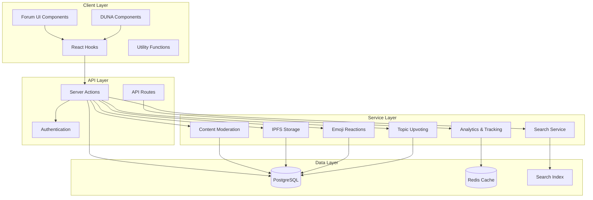
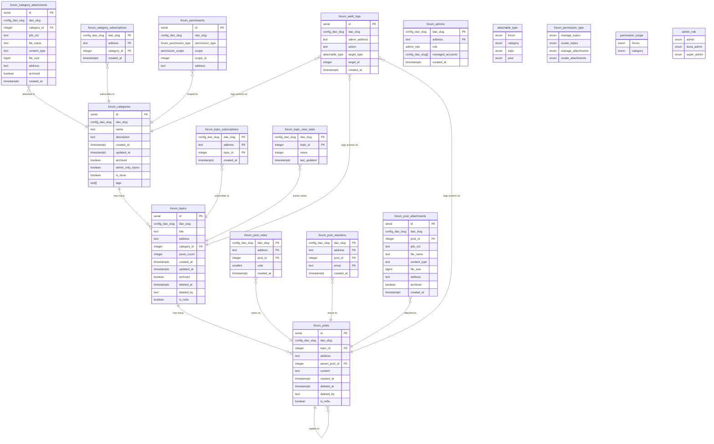
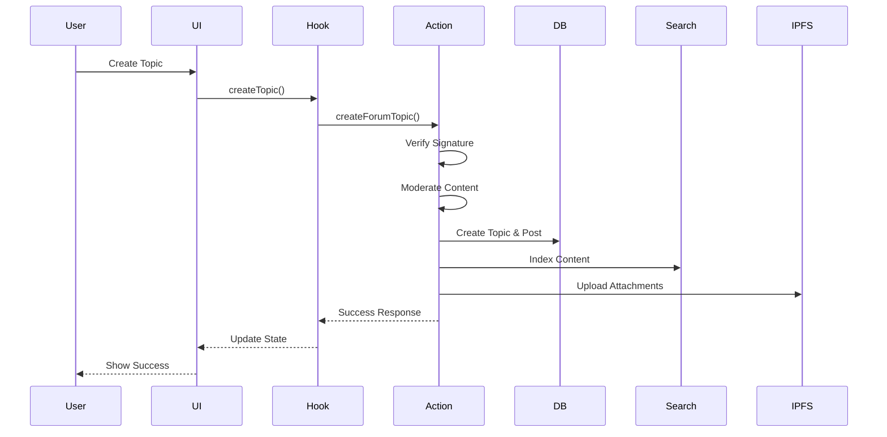
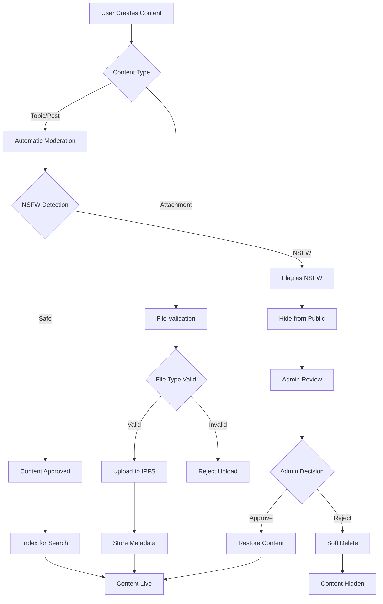
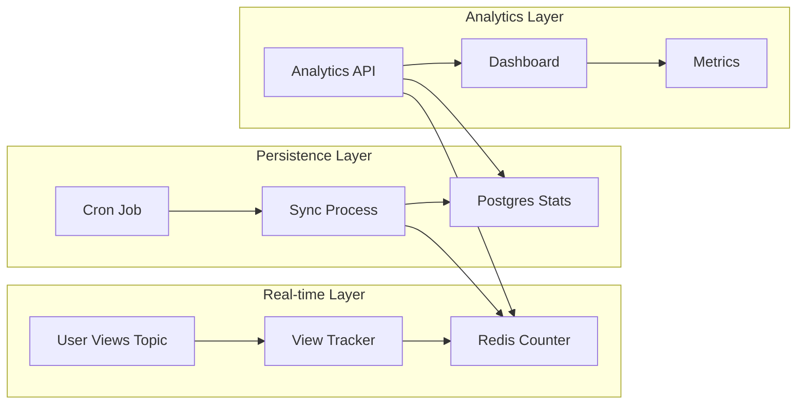
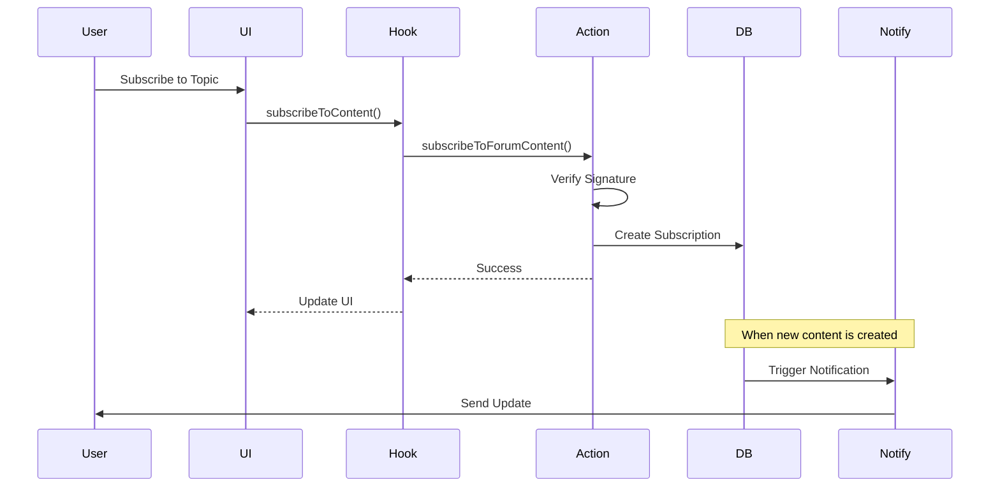
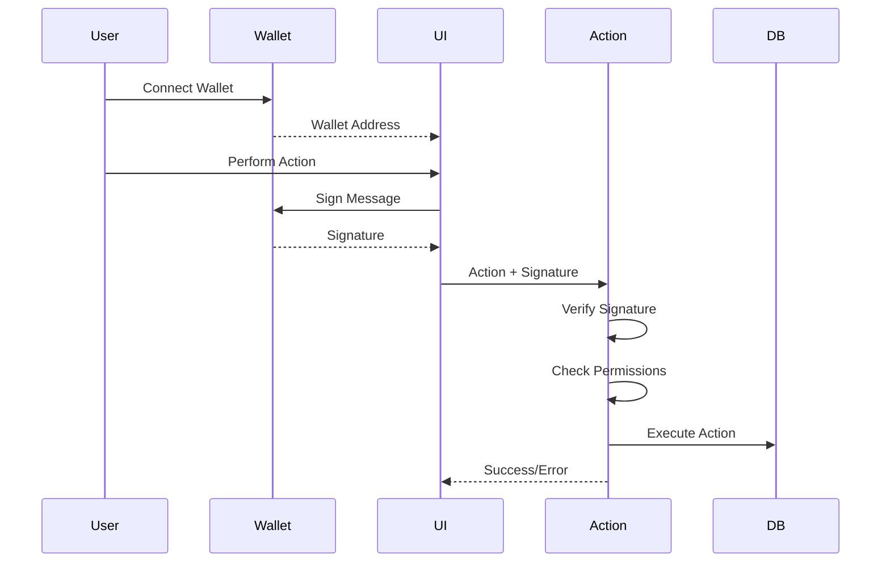
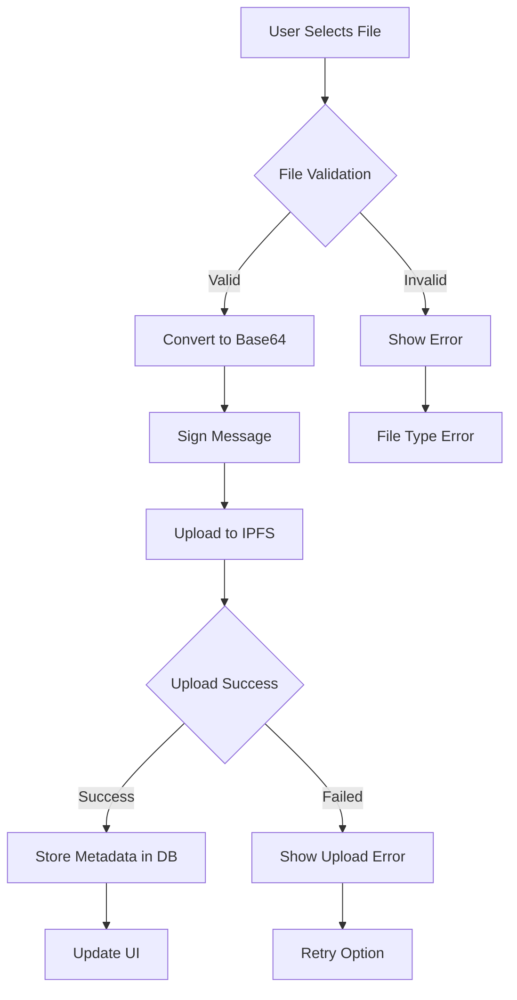
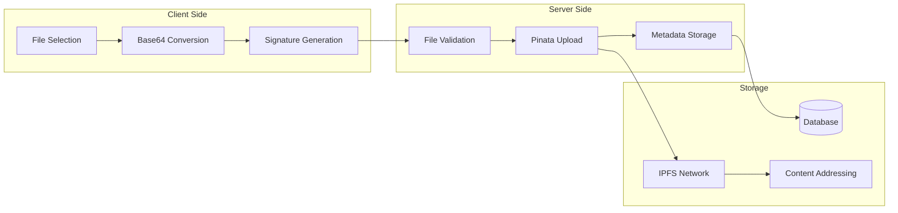

# Forum System Documentation

## Overview

The Agora Forum system is a comprehensive discussion platform built for DAO governance and community engagement. It provides a multi-tenant architecture supporting categories, topics, posts, attachments, reactions, upvoting, and advanced moderation features. The system includes specialized DUNA integration for quarterly reports and document management.

### Key Features

- **Multi-tenant Architecture**: Isolated data per DAO using `dao_slug`
- **Real-time Interactions**: Emoji reactions, upvoting, and live updates
- **Content Moderation**: NSFW detection, soft/hard deletion, archival
- **File Management**: IPFS-based document storage and sharing
- **Search Integration**: Full-text search with real-time indexing
- **Admin System**: Role-based permissions and audit logging
- **DUNA Integration**: Specialized components for quarterly reports

## Architecture

### System Overview



### Database Schema

The forum system uses PostgreSQL with Prisma ORM and follows a multi-tenant architecture where each DAO has its own data isolation through `dao_slug`.

#### Core Entities



### Key Design Decisions

1. **Post-Centric Design**: All user interactions (votes, reactions) are post-specific
2. **Multi-Tenant Architecture**: Every table includes `dao_slug` for tenant isolation
3. **Content Moderation**: Supports archival, soft deletion, hard deletion, and NSFW filtering
4. **Enhanced Admin System**: Role hierarchy with granular permissions
5. **Real-time Analytics**: Redis overlay for view tracking with Postgres persistence

## API Layer

### Data Flow Architecture



### Server Actions

The forum system uses Next.js server actions for all database operations:

#### Topics (`src/lib/actions/forum/topics.ts`)

- `getForumTopics(options)` - Fetch topics with pagination and filtering
- `getForumTopic(topicId)` - Get single topic with posts
- `createForumTopic(data)` - Create new topic with signature verification
- `deleteForumTopic(data)` - Hard delete topic (admin only)
- `softDeleteForumTopic(data)` - Soft delete topic
- `restoreForumTopic(data)` - Restore soft-deleted topic
- `archiveForumTopic(data)` - Archive topic
- `upvoteForumTopic(data)` - Upvote a topic
- `removeUpvoteForumTopic(data)` - Remove upvote from topic
- `getForumTopicUpvotes(topicId)` - Get upvote count for topic
- `getMyForumTopicVote(topicId, address)` - Get user's vote on topic

#### Posts (`src/lib/actions/forum/posts.ts`)

- `createForumPost(topicId, data)` - Create new post/reply
- `deleteForumPost(data)` - Hard delete post
- `softDeleteForumPost(data)` - Soft delete post
- `restoreForumPost(data)` - Restore soft-deleted post
- `getForumPostsByTopic(topicId)` - Get all posts for a topic
- `getForumPost(postId)` - Get single post

#### Reactions (`src/lib/actions/forum/reactions.ts`)

- `addForumReaction(data)` - Add emoji reaction to post
- `removeForumReaction(data)` - Remove emoji reaction from post

#### Categories (`src/lib/actions/forum/categories.ts`)

- `getForumCategories()` - Fetch all categories
- `getForumCategory(categoryId)` - Get single category
- `getDunaCategoryId()` - Get DUNA-specific category

#### Attachments (`src/lib/actions/forum/attachments.ts`)

- `getForumAttachments()` - Fetch all attachments
- `uploadFileToIPFS(file)` - Upload file to IPFS
- `uploadDocumentFromBase64(data, fileName, contentType, address, signature, message, categoryId)` - Upload document
- `deleteForumAttachment(data)` - Delete attachment
- `archiveForumAttachment(data)` - Archive attachment

#### Admin (`src/lib/actions/forum/admin.ts`)

- `checkForumPermissions(address, categoryId?)` - Check user permissions
- `logForumAuditAction(daoSlug, adminAddress, action, targetType, targetId)` - Log admin actions

#### Analytics (`src/lib/actions/forum/analytics.ts`)

- `trackForumView(data)` - Track topic view
- `getForumViewStats(targetType, targetId)` - Get view statistics
- `subscribeToForumContent(data)` - Subscribe to topic/category
- `unsubscribeFromForumContent(data)` - Unsubscribe from content
- `getForumSubscriptions(address)` - Get user subscriptions

#### Search (`src/lib/actions/forum/search.ts`)

- `indexForumTopic(data)` - Index topic for search
- `indexForumPost(data)` - Index post for search
- `removeForumTopicFromIndex(topicId, daoSlug)` - Remove from search index
- `removeForumPostFromIndex(postId, daoSlug)` - Remove from search index

### API Routes

#### View Sync (`src/app/api/v1/forum/sync-views/route.ts`)

- `POST /api/v1/forum/sync-views` - Sync Redis view counts to Postgres (cron job)

## Frontend Layer

### Hooks

#### `useForum` Hook (`src/hooks/useForum.ts`)

Main hook for forum operations:

```typescript
const {
  loading,
  error,
  isAuthenticated,
  fetchTopics,
  fetchTopic,
  createTopic,
  createPost,
  deleteTopic,
  deletePost,
  deleteAttachment,
  fetchDocuments,
  uploadDocument,
  fetchCategories,
  archiveTopic,
  archiveAttachment,
  restoreTopic,
  restorePost,
} = useForum();
```

#### `useForumAdmin` Hook

Permission checking hook:

```typescript
const {
  isAdmin,
  canCreateTopics,
  canManageTopics,
  canCreateAttachments,
  canManageAttachments,
  isLoading,
} = useForumAdmin(categoryId?);
```

### Utilities

#### `forumUtils.ts` (`src/lib/forumUtils.ts`)

Type definitions and utility functions:

```typescript
interface ForumTopic {
  id: number;
  title: string;
  author: string;
  content: string;
  createdAt: string;
  comments: ForumPost[];
  attachments: ForumAttachment[];
  deletedAt?: string | null;
  deletedBy?: string | null;
  isNsfw?: boolean;
}

interface ForumPost {
  id: number;
  author: string;
  content: string;
  createdAt: string;
  parentId?: number;
  attachments?: ForumAttachment[];
  deletedAt?: string | null;
  deletedBy?: string | null;
  isNsfw?: boolean;
}

interface ForumCategory {
  id: number;
  name: string;
  description?: string;
  archived: boolean;
  adminOnlyTopics: boolean;
  createdAt: string;
  updatedAt: string;
  isDuna?: boolean;
}

// Utility functions
function transformForumTopics(
  data: any[],
  options?: TransformForumTopicsOptions
): ForumTopic[];
function canArchiveContent(
  userAddress: string,
  contentAuthor: string,
  isAdmin: boolean,
  isModerator: boolean
): boolean;
function canDeleteContent(
  userAddress: string,
  contentAuthor: string,
  isAdmin: boolean,
  isModerator: boolean
): boolean;
```

## Interactive Features

### Emoji Reactions

The forum system supports emoji reactions on posts, allowing users to express their feelings and engagement:

#### `EmojiReactions` Component (`src/components/Forum/EmojiReactions.tsx`)

- **Default Emojis**: 👍, 🔥, 🤔, 👀, 🎉, ❤️, 👏, 😄, 🤝
- **Real-time Updates**: Optimistic UI updates with server sync
- **User-specific**: Tracks which users have reacted with which emojis
- **Unicode Normalization**: Ensures consistent emoji storage using NFC normalization

#### Features:

- Click to add/remove reactions
- Visual feedback for user's own reactions
- Reaction count display
- Popover picker for emoji selection
- Graceful error handling with rollback

### Topic Upvoting

Users can upvote topics to show support and help surface quality content:

#### Upvoting System:

- **One vote per user per topic**: Prevents vote manipulation
- **Real-time counts**: Immediate UI updates
- **Signature verification**: All votes require wallet signature
- **Vote persistence**: Stored in `forum_post_votes` table

#### Features:

- Upvote/remove upvote functionality
- Vote count display on topic cards
- User vote status tracking
- Admin and author vote management

### Admin Badges

Visual indicators for forum administrators and moderators:

#### `ForumAdminBadge` Component (`src/components/Forum/ForumAdminBadge.tsx`)

- **Role-based badges**: Different styles for different admin roles
- **Admin types**: Admin, Duna Admin, Super Admin
- **Visual hierarchy**: Color-coded badges for easy identification
- **Contextual display**: Shows on user avatars and content

## DUNA Integration

The forum system includes special integration for DUNA (Decentralized Universal Node Administration) with dedicated components:

### Components

#### `DunaAdministration.tsx`

Main DUNA administration component that fetches and displays documents and reports. Includes tenant-specific configuration and error handling.

#### `QuarterlyReportsSection.tsx`

Manages quarterly reports with:

- Report creation and display
- Comment system integration
- Archive/delete functionality
- Pagination for older reports
- Real-time updates

#### `DocumentsSection.tsx`

Handles document management with:

- Document upload and display
- File type validation and support
- Archive/delete operations
- Permission-based access control
- Progress tracking for uploads

#### `QuarterlyReportCard.tsx`

Individual report card component with metadata display and interaction controls.

#### `ReportModal.tsx`

Modal for viewing full reports with:

- Full report content display
- Comment system integration
- Reply functionality
- Admin controls for moderation
- Real-time comment updates

#### `DocumentUploadModal.tsx`

Modal for uploading new documents with:

- File selection and validation
- Progress tracking
- Error handling and retry
- File type restrictions
- Size limit enforcement

#### `CommentList.tsx`

Comment system for reports and posts with:

- Nested reply support
- Real-time updates
- Moderation controls
- User identification

#### `CreatePostModal.tsx`

Modal for creating new posts and replies with rich text editing capabilities.

## Content Moderation

### Moderation Flow



### Automatic Moderation

- **NSFW Detection**: Automatic content filtering using Open AI moderation service
- **Content Analysis**: Text analysis for inappropriate content
- **Auto-flagging**: Automatic flagging of problematic content

### Manual Moderation

- **Soft Delete**: Content hidden but recoverable
- **Hard Delete**: Permanent removal from database
- **Archive**: Content moved to archived state
- **Restore**: Recovery of soft-deleted content

### Permission System

- **Role-based Access**: Admin, Duna Admin, Super Admin roles
- **Granular Permissions**: Topic creation, management, attachment handling
- **Scope-based Access**: Forum-wide or category-specific permissions

## Search Integration

### Search Service

- **Full-text Search**: Topics and posts indexed for search
- **Real-time Indexing**: Automatic indexing on content creation
- **Multi-tenant Search**: Isolated search per DAO
- **Content Filtering**: NSFW content excluded from search

### Search Features

- Topic and post content search
- Author-based filtering
- Category-based filtering
- Date range filtering

## Analytics and Tracking

### View Tracking Architecture



### Subscription Flow



### View Tracking

- **Redis Overlay**: Real-time view counting
- **Postgres Persistence**: Long-term storage
- **Cron Sync**: Regular synchronization between Redis and Postgres
- **Unique Views**: IP and address-based deduplication

### Subscription System

- **Topic Subscriptions**: Follow specific topics
- **Category Subscriptions**: Follow entire categories
- **Notification System**: Real-time updates for subscribed content

## Security Features

### Authentication Flow



### Authentication

- **Wallet Integration**: Web3 wallet authentication
- **Signature Verification**: Signature validation
- **Message Signing**: Required for all write operations

### Authorization

- **Permission Checks**: Granular permission validation
- **Admin Roles**: Hierarchical admin system
- **Content Ownership**: Author-based access control

### Audit Trail

- **Action Logging**: Complete audit log of admin actions
- **Target Tracking**: Specific content and user tracking
- **Timestamp Recording**: Precise action timing

## File Management

### File Upload Flow



### IPFS Integration Architecture



### IPFS Integration

- **Decentralized Storage**: Files stored on IPFS
- **Content Addressing**: Immutable file references
- **Metadata Storage**: File information in database
- **Access Control**: Permission-based file access

### File Types

- **Document Support**: PDF, DOC, TXT, etc.
- **Image Support**: JPG, PNG, GIF, etc.
- **Size Limits**: Configurable file size restrictions
- **Type Validation**: MIME type verification

## Configuration

### Environment Variables

- `DATABASE_URL`: PostgreSQL connection string
- `REDIS_URL`: Redis connection for caching
- `PINATA_API_KEY`: IPFS file storage API key
- `PINATA_SECRET_KEY`: IPFS file storage secret key
- `CRON_SECRET`: Cron job authentication secret
- `NEXT_PUBLIC_PINATA_GATEWAY`: IPFS gateway URL for file access
